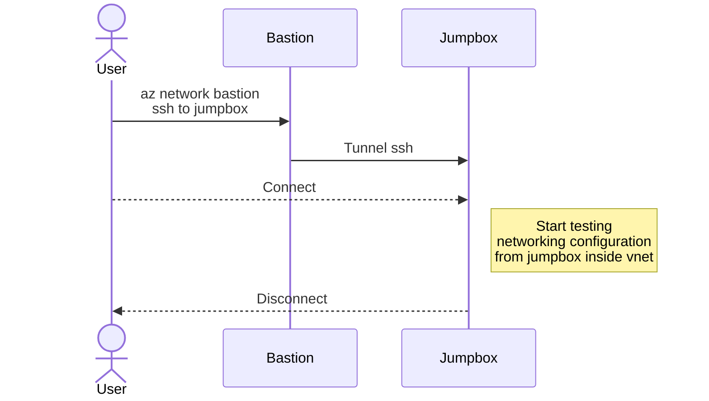
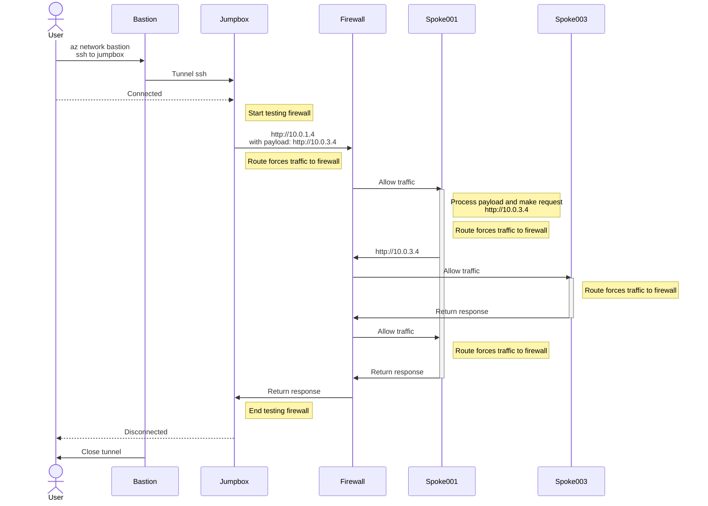

# Diagrams

## Firewall test process

```mermaid
sequenceDiagram
    actor User
    participant Bastion
    participant Jumpbox
    User->>Bastion: az network bastion<br/>ssh to jumpbox
    Bastion->>Jumpbox: Tunnel ssh
    User-->>Jumpbox: Connect
    Note right of Jumpbox: Start testing<br/>networking configuration<br/>from jumpbox inside vnet
    Jumpbox-->>User: Disconnect
```

## Request flow sequence diagram

```mermaid
sequenceDiagram
    actor User
    participant Bastion
    participant Jumpbox
    participant Firewall
    User->>Bastion: az network bastion<br/>ssh to jumpbox
    Bastion->>Jumpbox: Tunnel ssh
    User-->>Jumpbox: Connected
    Note right of Jumpbox: Start testing firewall
    Jumpbox->>Firewall: http://10.0.1.4<br/>with payload: http://10.0.3.4
    Note right of Jumpbox: Route forces traffic to firewall
    Firewall->>Spoke001: Allow traffic
    activate Spoke001
    Note right of Spoke001: Process payload and make request<br/>http://10.0.3.4
    Note right of Spoke001: Route forces traffic to firewall
    Spoke001->>Firewall: http://10.0.3.4
    Firewall->>Spoke003: Allow traffic
    activate Spoke003
    Note right of Spoke003: Route forces traffic to firewall
    Spoke003->>Firewall: Return response
    deactivate Spoke003
    Firewall->>Spoke001: Allow traffic
    Note right of Spoke001: Route forces traffic to firewall
    Spoke001->>Firewall: Return response
    deactivate Spoke001
    Firewall->>Jumpbox: Return response
    Note right of Jumpbox: End testing firewall
    Jumpbox-->>User: Disconnected
    Bastion->>User: Close tunnel
```
